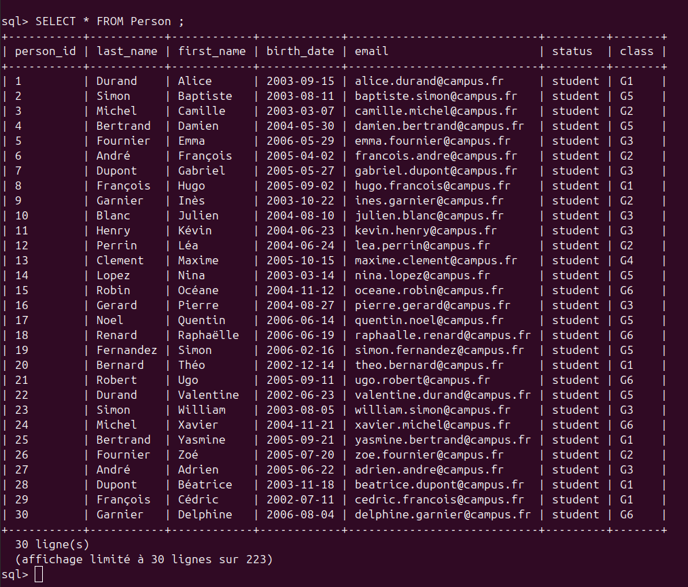
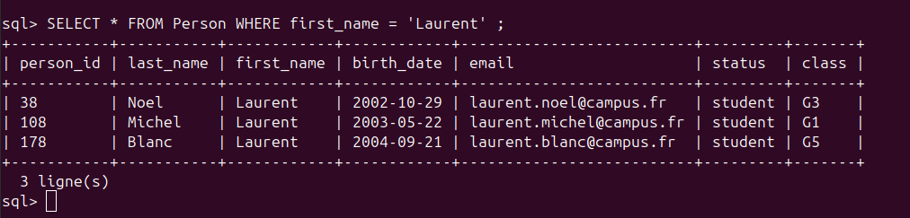
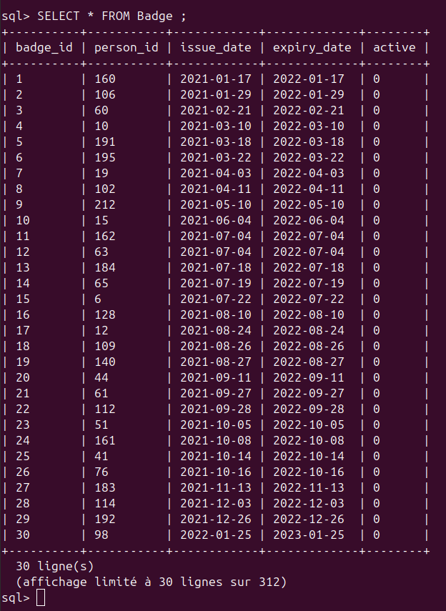
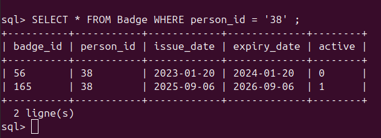

# Write-up Super enQuête Libre [1/4]

**- Nom :** Super enQuête Libre [1/4]  
**- Catégorie :** Divers  
**- Points :** 100  
**- Niveau de difficulté :** Intro

### Description : 
&emsp;Vous êtes un enquêteur mandaté par Télématique NordRouan, une école réputée dans le domaine de la poterie, pour élucider une affaire de vol. Des pièces d’une valeur inestimable ont disparu et il est impératif de retrouver le coupable, sous peine de voir l’établissement fermer ses portes.

&emsp;Pour mener votre enquête, vous obtenez l’accès à une base de données recensant l’ensAemble des étudiants, professeurs et employés de l’école. Avant de vous confier l’affaire, l’école souhaite évaluer vos compétences. Votre première mission : déterminer quel badge Noel Laurent utilise actuellement. Format du flag : 404CTF{badge_noel_laurent} Exemple du flag : 404CTF{19}  
  
Dans l'énoncé de ce challenge, il nous est également donnée la commande pour se connecter `nc spawn.404ctf.fr 10401`.
  

On peut alors commencer par regarder l'aide avec la commande `.help`.  

**Commandes spéciales :**  
&emsp;.help           Affiche cette aide  
&emsp;.tables         Liste les tables disponibles  
&emsp;.schema [TABLE] Affiche le schéma d'une table (ou toutes)  
&emsp;.quit / .exit   Quitte le shell  

C'est alors qu'on apprend qu'il est possible de lister les tables disponibles avec `.tables` et on obtient :  
&emsp;AccessLog   Attendance   Badge   Building   Course   Person   Room   sqlite_sequence

Sachant que l'on cherche l'id de Noel Laurent pour trouver quel badge il utilise, on utilise la requête sql `SELECT * FROM Person ;` afin d'afficher tout le tableau "Person".



On repère 7 colonnes : person_id | last_name | first_name | birth_date | email | status | class.  
Alors, on récupère le person_id de Noel Laurent avec `SELECT * FROM Person WHERE first_name = 'Laurent' ;` et on obtient :  

  

Donc le person_id de Noel Laurent est 38  

On affiche ensuite le tableau "Badge" afin de connaitre les colonnes : `SELECT * FROM Badge ;` et on obtient :  



Enfin, on peut obtenir le numéro de badge et trouver quel badge utilise Noel Laurent avec la requête `SELECT * FROM Badge WHERE person_id = '38' ;` 



L'un des badges est actif et l'autre est inactif, le badge qu'utilise Noel Laurent est celui qui est actif soit le badge n°165

Flag :  
```
404CTF{165}
```
