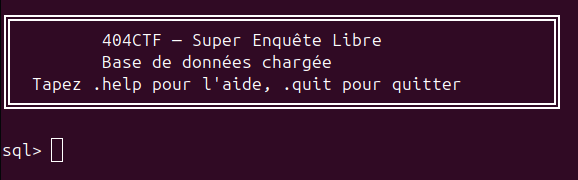

# Write-up Super enQuête Libre [1/4]

**- Nom :** Super enQuête Libre [1/4]  
**- Catégorie :** Divers  
**- Points :** 100  
**- Niveau de difficulté :** Intro

### Description : 
&emsp;Vous êtes un enquêteur mandaté par Télématique NordRouan, une école réputée dans le domaine de la poterie, pour élucider une affaire de vol. Des pièces d’une valeur inestimable ont disparu et il est impératif de retrouver le coupable, sous peine de voir l’établissement fermer ses portes.

&emsp;Pour mener votre enquête, vous obtenez l’accès à une base de données recensant l’ensemble des étudiants, professeurs et employés de l’école. Avant de vous confier l’affaire, l’école souhaite évaluer vos compétences. Votre première mission : déterminer quel badge Noel Laurent utilise actuellement. Format du flag : 404CTF{badge_noel_laurent} Exemple du flag : 404CTF{19}  
  
Dans l'énoncé de ce challenge, il nous est également donner la commande pour se connecter `nc spawn.404ctf.fr 10401`.
  

On peut alors commencer par regarder l'aide avec la commande `.help`.  

**Commandes spéciales :**  
&emsp;.help           Affiche cette aide  
&emsp;.tables         Liste les tables disponibles  
&emsp;.schema [TABLE] Affiche le schéma d'une table (ou toutes)  
&emsp;.quit / .exit   Quitte le shell  

C'est alors qu'on apprend qu'il est possible de lister les tables disponibles avec `.tables` et on obtient :  
&emsp;AccessLog   Attendance   Badge   Building   Course   Person   Room   sqlite_sequence

```
SELECT * FROM Person ;
```
```
SELECT * FROM Person WHERE first_name = 'Laurent' ;
```
```
SELECT * FROM Badge ;
```
```
SELECT * FROM Badge WHERE person_id = '38' ;
```
